# 🚂 ascii-train

Animated ASCII train SVG for GitHub profile READMEs — generated automatically with random train compositions.

[](LICENSE)
[](package.json)
[](.github/workflows/train-animation.yml)

> Built on the **gh-ascii** framework by [crafter-station](https://github.com/crafter-station/gh-ascii).

> Inspired by the classic `sl` terminal train.

## Preview



## Features

* 🚂 **Random train compositions** — each generation creates 30 different trains
* 🚃 **5–8 wagons** — random wagon count and wagon types
* 🚂 **Multiple locomotives** — 4 different locomotive designs
* 💨 **Animated smoke** — random smoke particles with drift and fade
* 🎨 **Accent color** — configurable GitHub-style accent color
* 🛤️ **Fixed rail** — the track stays in place while the train passes over it
* 🔄 **Continuous animation** — trains pass sequentially with a pause between them
* ⚡ **100% SVG/CSS animation** — no JavaScript is required inside the generated SVG
* 🤖 **Daily regeneration** — GitHub Actions generates a new set of trains every day

## How it works

```text
src/generate-train.js
 ├─ Pick random locomotive
 ├─ Pick random wagon count (5–8)
 ├─ Pick random wagons
 ├─ Generate random smoke particles
 ├─ Build 30 unique train compositions
 ├─ Animate compositions with SVG <animateTransform>
 └─ Write output/train.svg

GitHub Action
 └─ Runs daily → generates a new train.svg → commits → pushes
```

The SVG contains all 30 randomly generated compositions.

The animation itself runs entirely inside the SVG, so GitHub does not need to execute JavaScript or make additional requests while displaying it.

Every new generation creates a new random set of trains.

## Project structure

```text
ascii-train/
├── .github/
│   └── workflows/
│       └── train-animation.yml
│
├── output/
│   └── train.svg
│
├── src/
│   ├── generate-train.js
│   ├── CONTEXTO3.md
│   ├── LICENSE
│   ├── package-lock.json
│   ├── package.json
│   ├── README.md
│   └── sl.json
│
└── .gitignore
```

## Configuration

Edit `src/generate-train.js` → `CONFIG`:

| Parameter        |   Default | Description                           |
| ---------------- | --------: | ------------------------------------- |
| `width`          |     `720` | SVG width                             |
| `height`         |     `130` | SVG height                            |
| `trainSpeed`     |       `5` | Seconds for each train crossing       |
| `pauseDuration`  |       `3` | Seconds between crossings             |
| `compositions`   |      `30` | Number of random train compositions   |
| `minWagons`      |       `5` | Minimum wagon count                   |
| `maxWagons`      |       `8` | Maximum wagon count                   |
| `wagonGap`       |     `-15` | Spacing between locomotive and wagons |
| `smokeParticles` |       `5` | Smoke particles per locomotive        |
| `railY`          |      `98` | Vertical position of the rail         |
| `accentColor`    | `#58a6ff` | Train accent color                    |

## Usage in a README

```md

```

The generated SVG can also be embedded directly:

```html
<object
  data="train.svg"
  type="image/svg+xml">
</object>
```

## Development

Generate the SVG locally:

```bash
npm run generate
```

The generated file will be written to:

```text
output/train.svg
```

## Automation

The project uses GitHub Actions to regenerate the SVG automatically.

The workflow runs once per day at **02:00 UTC** and:

1. Checks out the repository
2. Installs Node.js
3. Generates a new `train.svg`
4. Commits the generated file if it changed
5. Pushes the update to the repository

The workflow can also be triggered manually with `workflow_dispatch`.

## Credits

* **Original concept:** [crafter-station/gh-ascii](https://github.com/crafter-station/gh-ascii)
* **Inspiration:** `space-invaders-contributions`
* **Style:** neofetch / fastfetch accent-color system
* **Terminal train:** `sl`

## License

MIT — see [`src/LICENSE`](src/LICENSE).
